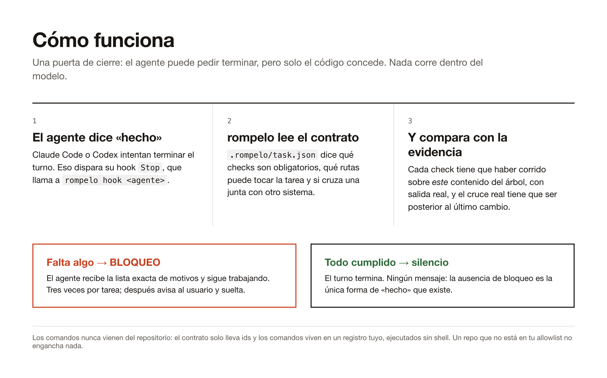
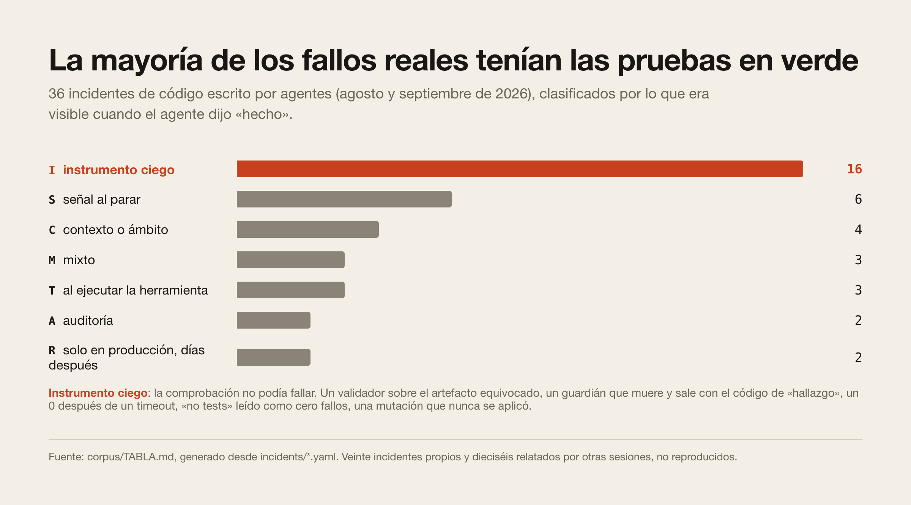
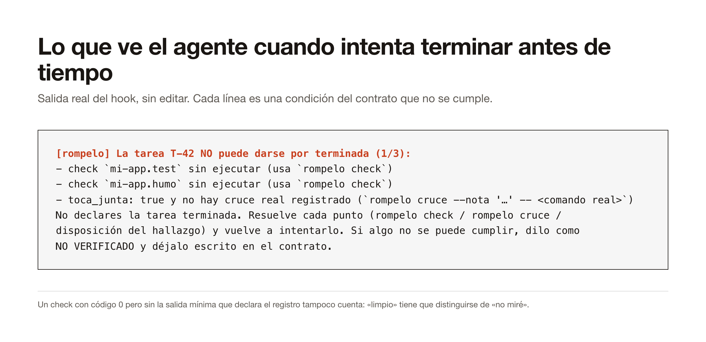
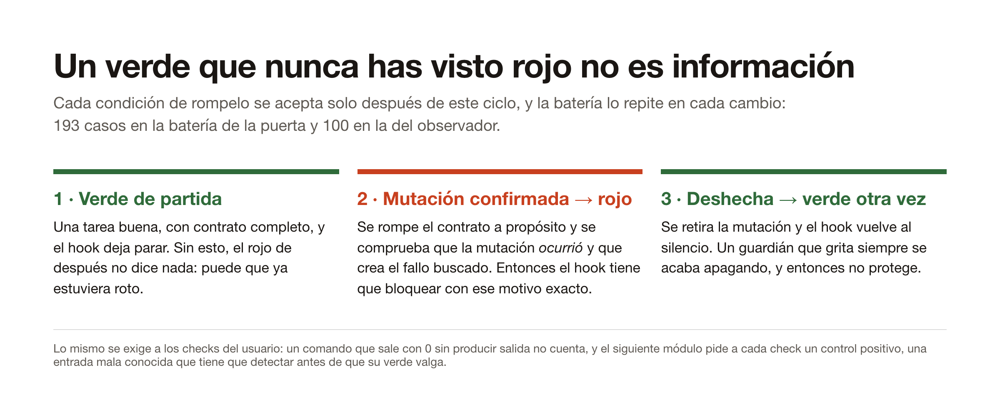

# rompelo

**Tu agente de código no puede decir «hecho» hasta que una comprobación que se ha visto fallar diga que sí.**

`rompelo` es una puerta de cierre para agentes de código. Se engancha al hook `Stop` de Claude
Code y de Codex, lee un contrato pequeño de la tarea en curso y no deja terminar hasta que la
evidencia existe: checks ejecutados sobre el código actual, una petición real por el camino
desplegado cuando dos sistemas tienen que coincidir, hallazgos con decisión, afirmaciones con
fuente. Lo decide código normal, fuera del modelo. Un verde que no podía haber sido rojo no cuenta.

English documentation: [README.md](README.md).

## Cómo funciona



## El problema del que parte



Treinta y seis incidentes reales de un mes de código escrito por agentes, cada uno anotado con lo
que parecía verde cuando el agente dijo «hecho» ([corpus/TABLA.md](corpus/TABLA.md), generado
desde [incidents/](incidents/)). La clase mayor no es «la prueba falló». Es «la comprobación no
podía fallar»: un validador sobre el artefacto equivocado, un guardián que muere y sale con el
código reservado a un hallazgo real, un `0` después de un timeout, «no tests» leído como cero
fallos, una mutación que nunca se aplicó. Un modelo cuidadoso no los caza, porque nada parece
incoherente. Solo forzar el fallo los caza.

## Lo que ve el agente



El agente recibe la lista exacta de condiciones sin cumplir y sigue trabajando. Tres bloqueos
por tarea y sesión; después `rompelo` avisa al usuario y suelta, para que nadie quede atrapado.

## Cada puerta se vio en rojo antes de fiarse de ella



La batería (77 casos, en CI en cada push) aplica este ciclo a cada condición de la propia
puerta. Cuando una mutación se usa para forzar el rojo, la prueba confirma primero que la
mutación ocurrió. Una mutación que no se aplicó no prueba nada, y ese error está dos veces en el corpus.

## Se da cuenta de cuándo mirar más despacio

Comprobarlo todo, siempre, no aguanta un día real: un guardián que grita siempre se acaba
apagando. Por eso la puerta tiene un suelo barato y una capa de observación que sube el rigor
solo cuando salta uno de tres disparadores, y avisa antes de subirlo:

| Disparador | Salta con | Qué exige entonces la puerta |
|---|---|---|
| **riesgo de la tarea** | dos toques de escritura (no lecturas) a `auth`, secretos, migraciones, despliegues o una junta con otro sistema (`functions/api/`, webhooks, `process.env`); una dependencia nueva basta con un toque (`pnpm add`, `package.json`) | cruce real aunque el contrato diga `toca_junta: false`; afirmaciones con fuente para una dependencia nueva |
| **patrón repetido** | la misma firma de error dos veces, el mismo check en rojo dos veces, un fichero editado cuatro veces sin un check verde entre medias, un comando que sale con 0 sin salida dos veces | una segunda pasada explícita antes de cerrar (`segunda_pasada` en el contrato) |
| **afirmaciones sobre el mundo** | `toca_exterior` en el contrato, o el disparador de dependencia de arriba | cada afirmación con `verificado` (fuente y cita), `derivado` o `no_verificado` |

El observador es un hook `PostToolUse` (`rompelo observe <agente>`). Nunca bloquea y nunca guarda
texto de comandos ni de salidas: un libro por sesión con programa, hash del comando, código de
salida, recuentos, firma normalizada del error y rutas tocadas, fuera del repo. Los umbrales
viven en `config/observacion.json`, los perfiles en `config/riesgo.json`, y la batería los muta
para demostrar que se leen. Subir a nivel 2 avisa al agente (tiene que decírtelo en dos líneas)
y no pide permiso; gastar en comprobaciones externas (nivel 3) sí: `rompelo permiso <patron>
si|no --recordar` guarda tu respuesta para preguntarte una sola vez. Diseño y límites en
[docs/observacion.md](docs/observacion.md).

## Qué exige la puerta

Un repo se alista con `rompelo init`, que escribe `.rompelo/task.json` y apunta el repo en una
allowlist local. Desde entonces el agente no puede terminar una tarea hasta que:

| Condición | Cómo se cumple |
|---|---|
| cada id de check ha corrido sobre el contenido **actual** del árbol (huella del contenido, no el commit) | `rompelo check`. Los ids se resuelven en tu `checks/registry.json` (argv, sin shell). La salida no se guarda nunca: solo código, duración y hash |
| un check que sale con 0 sin la salida mínima declarada **no** es verde | `min_lineas` en el registro |
| si la tarea toca una junta con otro sistema, un cruce real **después** del último cambio | `rompelo cruce -- <comando real>` o `--id <check del registro>` |
| cada hallazgo tiene disposición | `hallazgos` en el contrato |
| cada afirmación sobre el mundo exterior tiene estado | `afirmaciones`: `verificado` exige fuente de primera mano y cita textual, `derivado` exige de qué se deduce, `no_verificado` exige qué falta |
| cada fichero cambiado está dentro de `scope_paths` | o se amplía el scope a propósito |
| si se exige, hay un fichero de prueba en el diff | verde no es cubierto |

Lo que no hace, a propósito:

- Nunca ejecuta cadenas que vengan del repositorio. El contrato solo lleva ids; una orden
  inyectada se rechaza sin ejecutarse (probado con un fichero canario en la batería).
- Guarda silencio en repos fuera de la allowlist: un `.rompelo/` ajeno no engancha nada.
- No lee la salida de los comandos, que puede llevar secretos.
- Falla cerrado: un contrato ilegible en un repo alistado bloquea.
- Sin dependencias. Biblioteca estándar de Python 3.9 y git.

## El límite, dicho claro

El agente puede editar su propio contrato y podría escribir la evidencia a mano. La puerta frena
el descuido, no la trampa deliberada. El juez independiente es `rompelo verify --ci`: vuelve a
ejecutar cada check en un runner donde el agente no ha escrito nada, ignora la evidencia guardada
y deja el cruce real como lo único que CI no puede reproducir. Hay un workflow listo en
[`adapters/ci/rompelo-gate.yml`](adapters/ci/rompelo-gate.yml); este repositorio lo corre sobre sí mismo.

## Instalar

```bash
git clone https://github.com/bugroo/rompelo ~/rompelo
cp ~/rompelo/checks/registry.example.json ~/rompelo/checks/registry.local.json   # tus checks
```

O deja que `rompelo init` los encuentre: sin `--check`, lee los scripts de `package.json`,
`pyproject.toml`, `Cargo.toml`, `go.mod` y el `Makefile`, registra lo que encuentra en
`registry.local.json` como `<repo>.<nombre>` y lo mete en el contrato. En `registry.local.json`
viven tus comandos, un id cada uno, como argv:

```json
{
  "mi-app.test": {"argv": ["pnpm", "test"], "cwd": "repo", "min_lineas": 1},
  "mi-app.humo": {"argv": ["node", "scripts/humo.mjs"], "cwd": "repo"}
}
```

Después, el hook:

- **Claude Code**: añade las entradas `Stop` y `PostToolUse` de
  [`adapters/claude/settings-fragment.json`](adapters/claude/settings-fragment.json) a
  `~/.claude/settings.json`.
- **Codex**: fusiona [`adapters/codex/hooks.json`](adapters/codex/hooks.json) en
  `~/.codex/hooks.json` y confía el hook en `/hooks`. Detalle en
  [`adapters/codex/LEEME.md`](adapters/codex/LEEME.md).

## Usar

```bash
cd tu-repo
~/rompelo/bin/rompelo init --id T-42 --scope 'src/**' --check mi-app.test --junta
# ... el agente trabaja ...
~/rompelo/bin/rompelo check                                     # ejecuta los checks registrados y guarda evidencia
~/rompelo/bin/rompelo cruce --nota "petición real" -- curl -sf https://…   # el cruce real
~/rompelo/bin/rompelo close                                     # se niega si falta algo
```

`close` imprime un informe en llano y lo guarda junto a la evidencia: qué se comprobó (código,
duración, líneas de salida, el cruce real, las afirmaciones verificadas), qué no se pudo
comprobar (afirmaciones `no_verificado`, checks que solo corren en esta máquina) y qué queda a
tu cargo (hallazgos aceptados sin corregir).

`rompelo verify` enseña el veredicto en cualquier momento. `rompelo --help` lo lista todo.
Los mensajes del gate y del observador salen en español; con `ROMPELO_LANG=en` (o `"idioma":
"en"` en `config/observacion.json`) salen en inglés. El informe de cierre sigue en español.

## Verificado, y no

- 77 casos en [`tests/rompelo-stop-test.sh`](tests/rompelo-stop-test.sh), cada condición vista
  en rojo con una mutación confirmada y luego en verde. CI los corre en Ubuntu en cada push.
- El lado de Claude Code está cruzado en vivo: terminar un turno con el contrato sin cumplir
  devolvió el bloqueo con los motivos correctos, y la línea configurada en `settings.json` la
  reproduce [`tests/cruce-settings-claude.sh`](tests/cruce-settings-claude.sh), visto dar sus tres códigos.
- El observador está cruzado en vivo en Claude Code por los dos caminos: `PostToolUse` (que en
  Claude Code solo llega cuando la herramienta salió bien) y `PostToolUseFailure` (por donde
  llega un comando con salida distinta de 0). Hasta el 05-09 solo escuchaba el primero, así
  que dos de sus cuatro patrones no podían saltar nunca: eso es [INC-2026-0031](incidents/INC-2026-0031.yaml),
  y está en el corpus como un incidente más de instrumento ciego. Los dos primeros cruces
  destaparon además dos falsos positivos (prosa dentro de un heredoc leída como comando;
  códigos de salida leídos del texto), arreglados con caso en rojo primero.
- Control negativo con sesiones reales: [`tests/control-negativo-sesiones.py`](tests/control-negativo-sesiones.py)
  reproduce desde los transcripts locales lo que el hook habría recibido (sin guardar ni imprimir
  texto) y cuenta alarmas. Cinco sesiones, unos 2.300 eventos: de 7 alarmas a 2, las dos
  verdaderas; los cinco falsos positivos están arreglados con caso en rojo. El check exige que
  esas dos sigan saltando: un observador que dejara de mirar daría cero.
- El lado de Codex está cruzado en vivo (05-09, con `codex exec` sobre un repo desechable): con el
  contrato sin cumplir, el hook `Stop` devolvió el bloqueo con los dos motivos correctos, Codex
  cumplió el contrato por su cuenta (`check`, `cruce`, `close`) y el siguiente cierre fue silencio;
  con un modelo que insiste, tres bloqueos y a la cuarta el aviso al usuario. El observador también
  recibe cada herramienta de Codex.
- **Límite medido en Codex:** su `PostToolUse` entrega solo el texto que el modelo imprimió, sin
  código de salida ([INC-2026-0036](incidents/INC-2026-0036.yaml)). El observador lo deja como
  desconocido y saca la firma de error de la última línea por heurística; «check en rojo» y
  «verde ambiguo» no pueden saltar en Codex. En Claude Code sí, por `PostToolUseFailure`.
- **No verificado:** `checks_nivel3` con una herramienta externa real (Stryker, semgrep) en un repo de trabajo.

El nivel 3 existe: los checks caros o externos (mutation testing, un escáner de seguridad) van
en `checks_nivel3` del contrato. No se exigen hasta que el observador haya subido el repo a nivel
3 con `rompelo permiso <patron> si`; desde entonces `rompelo check` los ejecuta y la puerta los
exige como a cualquier otro.

## Hoja de ruta, en orden

1. Control positivo por check registrado: el instrumento tiene que detectar una entrada mala conocida antes de que su verde valga.
2. Que el informe de cierre pueda decir «visto fallar» de verdad, cuando cada check tenga control positivo.
3. Incidentes que se compilan en checks registrados: una lección como detector, no como prosa.
4. Perfiles de riesgo por repo, si la regla de los dos toques sigue gritando en uso real.

Cambios por versión: [CHANGELOG.md](CHANGELOG.md). Contribuir: [CONTRIBUTING.md](CONTRIBUTING.md).

## Trabajo relacionado

[Agentic OS](https://github.com/KbWen/agentic-os) exige un flujo por fases con evidencia en git
hooks y CI. [Hermes Agent](https://github.com/NousResearch/hermes-agent) aprende skills de la
experiencia. Stryker y PIT miden la fuerza de las pruebas con mutación. `rompelo` va al lado y
añade lo que ninguno comprueba: que la comprobación estaba mirando.

MIT.
