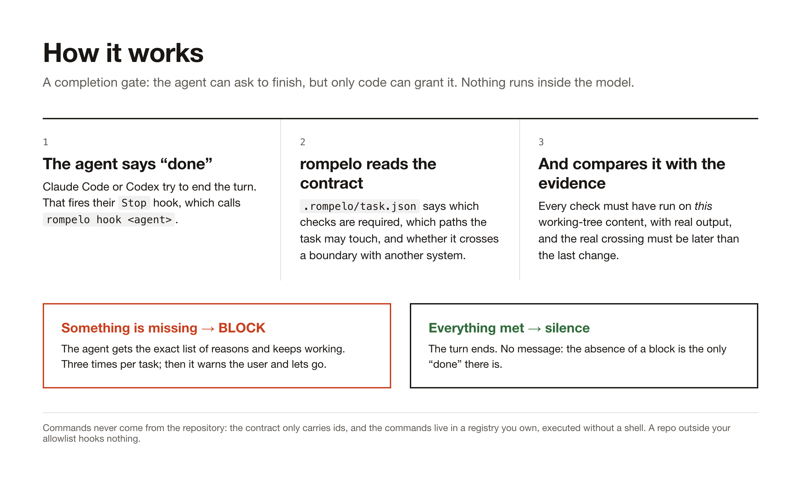
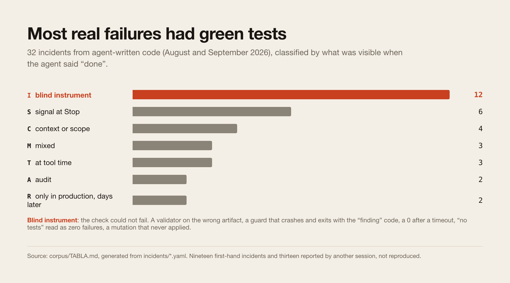
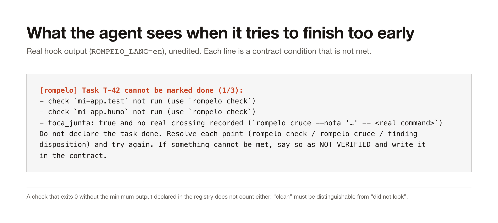
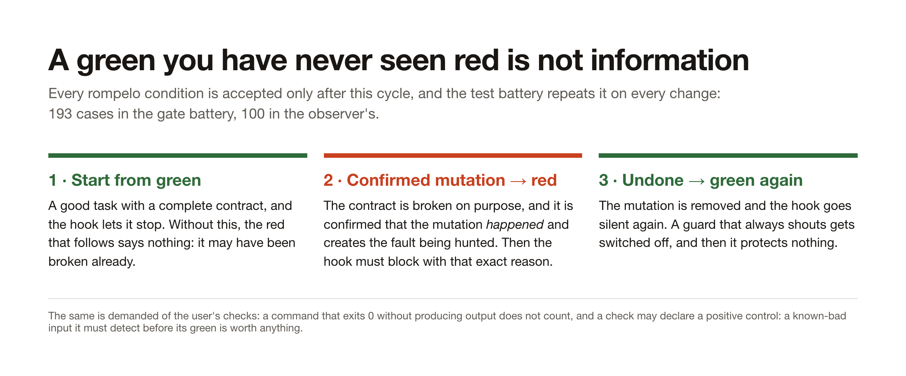

# rompelo

*Spanish for "break it."*

**Your coding agent cannot say "done" until a check that has been seen to fail says so.**

`rompelo` is a completion gate for AI coding agents. It plugs into the `Stop` hook of
Claude Code and Codex, reads a small contract for the current task, and blocks the agent from
finishing until the evidence exists: checks that ran on the current code, a real request
through the deployed path when two systems have to agree, findings with a decision, claims
with a source. Ordinary code decides, outside the model. Green results that could not have
been red do not count.

Documentación en español: [README.es.md](README.es.md).

## How it works



## The problem it is built around



Thirty-two real incidents from one month of agent-written code, each written down with what
looked green at the moment the agent said "done" ([corpus/TABLA.md](corpus/TABLA.md), generated
from [incidents/](incidents/)). The largest class is not "the test failed". It is "the check
could not fail": a validator run on the wrong artifact, a guard that crashed and exited with
the code reserved for a real finding, a `0` after a timeout, "no tests" read as zero failures, a
mutation that never applied. A careful model does not catch these, because nothing looks
inconsistent. Only forcing the check to fail does.

## What the agent sees



The agent receives the exact list of unmet conditions and keeps working. Three blocks per task
and session; after that `rompelo` warns the user and lets go, so nobody gets trapped.

## Every gate was seen red before it was trusted



The test battery (77 cases, run in CI on every push) applies this cycle to every condition of the
gate itself. When a mutation is used to force red, the test first confirms the mutation actually
happened. A mutation that did not apply proves nothing, and that mistake is in the corpus twice.

## It notices when to look harder

Checking everything, always, does not survive contact with a real day: a guard that always
shouts gets switched off. So the gate has a cheap floor and an observation layer that raises the
rigor only when one of three triggers fires, and warns before doing so:

| Trigger | Fires on | What the gate then demands |
|---|---|---|
| **task risk** | edits or commands touching `auth`, secrets, migrations, deploys, an integration boundary (`functions/api/`, webhooks, `process.env`), or a new dependency (`pnpm add`, `package.json`) | a real crossing even if the contract said `toca_junta: false`; claims with a source for a new dependency |
| **repeated pattern** | the same error signature twice, the same check red twice, one file edited four times without a green check in between, a command that exits 0 with empty output twice | an explicit second pass before closing (`segunda_pasada` in the contract) |
| **claims about the world** | `toca_exterior` in the contract, or the dependency trigger above | every claim with `verificado` (source + quote), `derivado` or `no_verificado` |

The observer is a `PostToolUse` hook (`rompelo observe <agent>`). It never blocks and it never
stores command text or output: per-session ledger with program name, a hash of the command, exit
code, line counts, a normalized error signature and the paths touched, kept outside the repo.
Thresholds live in `config/observacion.json`, risk patterns in `config/riesgo.json`, and the
battery mutates them to prove they are read. Raising to level 2 warns the agent (it must tell you
in two lines) and does not ask; spending on external checks (level 3) does: `rompelo permiso
<pattern> si|no --recordar` records your answer so you are asked once. Design and limits in
[docs/observacion.md](docs/observacion.md).

## What the gate enforces

A repo opts in with `rompelo init`, which writes `.rompelo/task.json` and adds the repo to a local
allowlist. From then on the agent cannot end a task until:

| Condition | Satisfied by |
|---|---|
| every check id ran on the **current** working-tree content (content fingerprint, not the commit) | `rompelo check`. Ids resolve through your `checks/registry.json` (argv, no shell). Output is never stored, only exit code, duration and a hash |
| a check that exits 0 without its declared minimum output is **not** green | `min_lineas` in the registry |
| if the task touches an integration boundary, a real crossing **after** the last change | `rompelo cruce -- <real command>` or `--id <registered check>` |
| every finding has a disposition | `hallazgos` in the contract |
| every claim about the outside world has a state | `afirmaciones`: `verificado` needs a primary source and a verbatim quote, `derivado` needs what it derives from, `no_verificado` needs what is missing |
| every changed file is inside `scope_paths` | or widen the scope on purpose |
| if required, a test file is part of the diff | green is not covered |

What it deliberately does not do:

- It never executes strings found in the repository. The contract only carries ids; an injected
  command is rejected without running (proven with a canary file in the battery).
- It stays silent in repos outside the allowlist, so a foreign `.rompelo/` folder hooks nothing.
- It never reads command output, which could contain secrets.
- It fails closed: an unreadable contract in an enrolled repo blocks.
- It has no dependencies. Python 3.9 standard library and git.

## The limit, said plainly

The agent can edit its own contract and could write evidence files by hand. The gate stops
carelessness, not a determined cheat. The independent judge is `rompelo verify --ci`: it
re-runs every check on a runner where the agent has written nothing, ignores stored evidence,
and reports the real boundary crossing as the one thing CI cannot reproduce. A ready-made
workflow is in [`adapters/ci/rompelo-gate.yml`](adapters/ci/rompelo-gate.yml); this repository
runs it on itself.

## Install

```bash
git clone https://github.com/bugroo/rompelo ~/rompelo
cp ~/rompelo/checks/registry.example.json ~/rompelo/checks/registry.local.json   # your checks
```

Or let `rompelo init` find them: with no `--check`, it reads `package.json` scripts, `pyproject.toml`,
`Cargo.toml`, `go.mod` and the `Makefile`, registers what it finds in `registry.local.json` as
`<repo>.<name>`, and puts them in the contract. `registry.local.json` is where your commands live,
one id each, as argv:

```json
{
  "my-app.test": {"argv": ["pnpm", "test"], "cwd": "repo", "min_lineas": 1},
  "my-app.smoke": {"argv": ["node", "scripts/smoke.mjs"], "cwd": "repo"}
}
```

Then connect the hook:

- **Claude Code**: add the `Stop` and `PostToolUse` entries from
  [`adapters/claude/settings-fragment.json`](adapters/claude/settings-fragment.json) to
  `~/.claude/settings.json`.
- **Codex**: merge [`adapters/codex/hooks.json`](adapters/codex/hooks.json) into
  `~/.codex/hooks.json` and trust the hook in `/hooks`. Details in
  [`adapters/codex/LEEME.md`](adapters/codex/LEEME.md).

## Use

```bash
cd your-repo
~/rompelo/bin/rompelo init --id T-42 --scope 'src/**' --check my-app.test --junta
# ... the agent works ...
~/rompelo/bin/rompelo check                                   # runs the registered checks, records evidence
~/rompelo/bin/rompelo cruce --nota "real request" -- curl -sf https://…   # the real crossing
~/rompelo/bin/rompelo close                                   # refuses if anything is missing
```

`close` prints a plain-language report and saves it next to the evidence: what was checked
(exit code, duration, lines of output, the real crossing, verified claims), what could not be
checked (claims marked `no_verificado`, checks that only run on this machine), and what is left
to you (findings accepted without a fix).

`rompelo verify` shows the current verdict at any time. `rompelo --help` lists everything.
The gate's messages are in Spanish today; English messages are on the roadmap.

## Verified, and not

- 77 cases in [`tests/rompelo-stop-test.sh`](tests/rompelo-stop-test.sh), each condition seen
  red with a confirmed mutation, then green. CI runs them on Ubuntu on every push.
- The Claude Code side has been crossed live: ending a turn with an unmet contract returned the
  block with the right reasons, and the configured `settings.json` line is replayed by
  [`tests/cruce-settings-claude.sh`](tests/cruce-settings-claude.sh), which has been seen to
  return all three of its exit codes.
- The observer is crossed live in Claude Code through both paths: `PostToolUse` (which Claude
  Code only sends when the tool succeeded) and `PostToolUseFailure` (where a command with a
  non-zero exit arrives). Until 05-09 it listened to the first one only, so two of its four
  patterns could never fire: that is [INC-2026-0031](incidents/INC-2026-0031.yaml), filed in the
  corpus as one more blind-instrument incident. The first two crossings also exposed two false
  positives (prose inside a heredoc read as a command; exit codes read from output text), fixed
  with a red case first.
- Negative control with real sessions: [`tests/control-negativo-sesiones.py`](tests/control-negativo-sesiones.py)
  replays, from local transcripts, what the hook would have received (storing and printing no
  text) and counts alarms. Five sessions, about 2,300 events: from 7 alarms down to 2, both
  true; the five false positives are fixed with a red case each. The check requires those two
  to keep firing: an observer that stopped looking would report zero.
- **Not verified:** the Codex side live. The adapter follows the official hook contract; the
  install and trust steps belong to the user. Nor the exact shape in which Codex delivers a
  failing command. Level 3 with external tools is not built.

## Roadmap, in order

1. Positive control per registered check: the instrument must detect a known-bad input before its green counts.
2. Level 3 for real: registered external checks (mutation testing, security scanners) that the observer can propose once you have given permission.
3. Closing report that says "seen failing" for real, once every check has a positive control.
4. English messages from the gate.
5. Incidents that compile into registered checks, so a lesson becomes a detector instead of prose.

## Related work

[Agentic OS](https://github.com/KbWen/agentic-os) enforces a phased workflow with evidence through
git hooks and CI. [Hermes Agent](https://github.com/NousResearch/hermes-agent) learns skills from
experience. Mutation testing tools such as Stryker and PIT measure test strength. `rompelo` sits
next to them and adds the part none of them checks: that the check itself was looking.

MIT.
